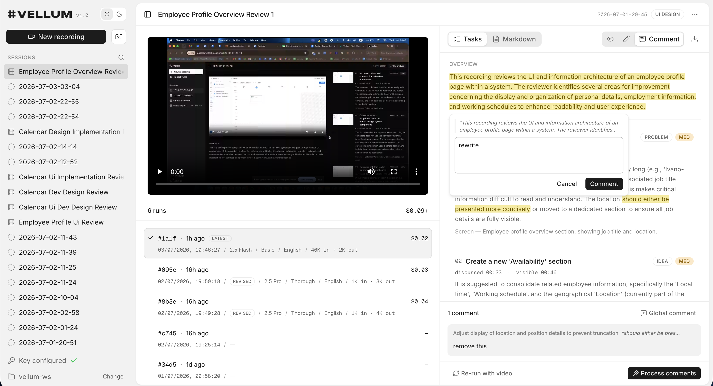

# Vellum

> Think out loud over your screen. Vellum turns the recording into a structured report — every point you made, timestamped, screenshotted, and sorted into tasks.

The best reviews happen out loud: you point at something and say what's wrong with it — then it vanishes into a screen recording nobody rewatches. Vellum keeps the substance instead. Talk through the work, and get back a clean, actionable report — problems, ideas, questions, and decisions, each linked to the exact moment and frame it came from. It runs entirely on your machine, under your own API key: no account, no cloud.

Built for design and product reviews — the analysis is tuned for critiquing UI, checking a build against its design, and reviewing docs — but the mechanic works for any spoken walkthrough of a screen.

<picture>
  <source media="(prefers-color-scheme: dark)" srcset="docs/assets/hero-dark.png">
  
</picture>

<!-- A short demo GIF of the record → report loop can go here later — see docs/assets/README.md -->

## Before you start — is this for you?

Vellum is deliberately narrow. It's a good fit if:

- You're on a **Chromium browser** (Chrome, Edge, Arc, Brave). Recording and the floating controls use APIs Firefox and Safari don't support.
- You're comfortable getting a **free Google AI Studio API key** and pasting it in once. Analysis runs on Gemini under *your* key — there's no hosted service.
- You want a **single-user, local** tool. Recordings live on your disk; nothing syncs to a cloud.

If you need meeting transcription, multi-user collaboration, or a hosted app, Vellum isn't that — see [Scope](#scope).

## Install and run

Vellum runs entirely on your machine. The web app is the tool; the `vellum` command just launches it.

```bash
# Requires Node.js 20+
npx @vasfal/vellum ui
```

That starts the local app and opens it in your browser. On first launch it walks you through pasting your Gemini key (stored in `~/.vellum/.env`, never sent anywhere but Google's API at analyze time) and picking a workspace folder for your recordings.

<details>
<summary>Or run from source (for development)</summary>

```bash
git clone https://github.com/vasfal/vellum.git
cd vellum
npm install
npm run dev          # starts on http://localhost:4270
```

For a global command from a local checkout: `npm link`, then `vellum ui`.
</details>

## Setting your API key

Analysis runs on Google Gemini under *your* key — there's no hosted service and no account. A key is free from [Google AI Studio](https://aistudio.google.com/apikey).

**In the app (recommended).** On first launch Vellum shows a prompt to paste your key, validates it, and saves it. You can change or remove it later from the sidebar. This is the path most people should use — no files, no restart.

<!-- screenshot: in-app key setup -->

**Power users / CLI.** If you'd rather not use the form, Vellum reads the key from the environment, in this order of precedence:

1. An exported `GEMINI_API_KEY` environment variable (wins over everything below).
2. `~/.vellum/.env` — the file the in-app form writes to. The launcher (`vellum ui`) loads it at every boot.
3. `.env.local` in a source checkout — copy [`.env.example`](.env.example) to `.env.local` and fill in `GEMINI_API_KEY`. Read by `npm run dev`.

`.env.example` also documents the optional `GEMINI_MODEL` and `GEMINI_FALLBACK_MODELS` overrides.

**Where the key lives.** It's stored only in `~/.vellum/.env` on your machine, written with `0600` permissions (readable by you alone). Vellum never logs it, never echoes it back, and never sends it anywhere but Google's Gemini API at analyze time. See [Privacy](#privacy).

## How it works

1. **Record** — click *New recording*, pick a screen or window, and talk through your review. Floating controls stay above your other windows.
2. **Stop** — the recording is saved to your workspace folder as `recording.webm`.
3. **Analyze** — click *Analyze*. Vellum uploads the recording to Gemini (under your key), which watches it and pulls out what you said and pointed at.
4. **Review** — a few minutes later you get a report: extracted tasks, each with a timestamp, a screenshot of the moment, a category, and a priority. Edit, comment, and re-run as you like.

## What goes into the report

For each task Vellum extracts:

- A descriptive title and a description with on-screen context
- A timestamp linking back to the moment in the video
- A screenshot of the relevant frame
- A category: `problem` / `idea` / `question` / `decision` / `followup` / `praise`
- A priority guess

Each session is tagged with a `review_type` (UI design, dev-vs-design, documentation, mixed) so the analysis adapts to the kind of review it is.

## Privacy

- Recordings live on your local filesystem, in the folder you choose.
- Only the analyze step sends video to Google (the Gemini API), under your own key.
- Your API key stays in `~/.vellum/.env` on your machine — it never leaves the local server.
- No telemetry, no analytics, no servers anyone else controls.

## Your files

Each session is a self-contained folder in your workspace:

```
~/vellum-sessions/
├── .vellum-workspace.json        ← marks this folder as a Vellum workspace
└── 2026-05-19-onboarding-review/
    ├── recording.webm            ← the raw recording
    ├── report.md                 ← the Markdown report
    ├── tasks.json                ← structured Gemini output, for re-rendering
    └── screenshots/
        ├── 00-03-42.png
        └── ...
```

Re-running analysis keeps your history — the latest report is always `report.md`, and previous runs are archived alongside it. Back up a session by copying its folder; share one by zipping it.

## Scope

**What Vellum does:** single-user design and product reviews · screen + microphone recording · AI analysis and task extraction · Markdown reports with embedded screenshots.

**What it doesn't (and isn't trying to):** meeting transcription · multi-user collaboration · live sharing · cloud sync · recording other people's screens · system-audio capture (microphone only).

## Troubleshooting

**The folder picker or floating controls don't work** — you need a Chromium-based browser. The File System Access and Document Picture-in-Picture APIs aren't in Firefox or Safari.

**Analysis takes a long time** — Gemini's File API is slower on the first upload of a long video. A 30-minute recording usually finishes in 3–5 minutes; 10+ minutes means something's wrong — check the terminal.

**The recording is silent** — grant the browser microphone permission and watch the audio meter while you talk.

**Gemini returned odd tasks** — usually poor recording quality (mumbled audio, blank screen). The prompt is tuned for design reviews; other kinds of review may need tuning.

## Contributing

Issues and pull requests are welcome. If you're developing Vellum rather than just using it, start with:

- [`ARCHITECTURE.md`](ARCHITECTURE.md) — the current locked state of the system
- [`DECISIONS.md`](DECISIONS.md) — the architecture decision log

Vellum is developed with AI assistance; the architecture docs above are the source of truth for how it fits together.

## License

[MIT](LICENSE).

## Acknowledgements

Built with Next.js, Tailwind, shadcn/ui, Google Gemini, and ffmpeg.

The name *Vellum* refers to the thin parchment medieval scribes wrote on — a surface for holding thought.
